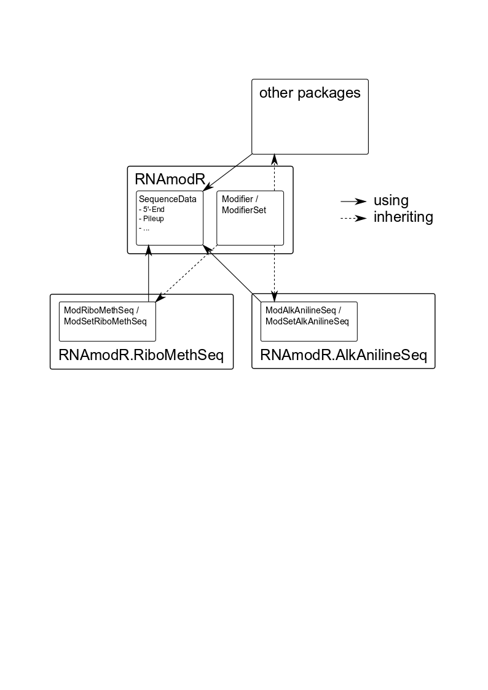

```{r style, echo = FALSE, results = 'asis'}
BiocStyle::markdown(css.files = c('custom.css'))
```

# Introduction

Post-transcriptional modifications can be found abundantly in rRNA and tRNA and
can be detected classically via several strategies. However, difficulties arise
if the identity and the position of the modified nucleotides is to be determined
at the same time. Classically, a primer extension, a form of reverse
transcription (RT), would allow certain modifications to be accessed by blocks
during the RT changes or changes in the cDNA sequences. Other modification would
need to be selectively treated by chemical reactions to influence the outcome of
the reverse transcription.

With the increased availability of high throughput sequencing, these classical
methods were adapted to high throughput methods allowing more RNA molecules to
be accessed at the same time. With these advances post-transcriptional
modifications were also detected on mRNA. Among these high throughput techniques
are for example Pseudo-Seq [[@Carlile.2014]](#References), RiboMethSeq
[[@Birkedal.2015]](#References) and AlkAnilineSeq
[[@Marchand.2018]](#References) each able to detect a specific type of
modification from footprints in RNA-Seq data prepared with the selected methods.

Since similar pattern can be observed from some of these techniques, overlaps of
the bioinformatical pipeline already are and will become more frequent with new
emerging sequencing techniques.

`RNAmodR` implements classes and a workflow to detect post-transcriptional RNA
modifications in high throughput sequencing data. It is easily adaptable to new
methods and can help during the phase of initial method development as well as
more complex screenings.

Briefly, from the `SequenceData`, specific subclasses are derived for accessing
specific aspects of aligned reads, e.g. 5’-end positions or pileup data. With
this a `Modifier` class can be used to detect specific patterns for individual
types of modifications. The `SequenceData` classes can be shared by different
`Modifier` classes allowing easy adaptation to new methods.

```{r, echo = FALSE}
suppressPackageStartupMessages({
  library(rtracklayer)
  library(Rsamtools)
  library(GenomicFeatures)
  library(RNAmodR.Data)
  library(RNAmodR)
})
```
```{r, eval = FALSE}
library(rtracklayer)
library(Rsamtools)
library(GenomicFeatures)
library(RNAmodR.Data)
library(RNAmodR)
```

## SequenceData

Each `SequenceData` object is created with a named character vector, which can
be coerced to a `BamFileList`, or named `BamFileList`. The names must be either
"treated" or "control" describing the condition the data file belongs to. 
Multiple files can be given per condition and are used as replicates.

```{r example_files, include=FALSE}
annotation <- GFF3File(RNAmodR.Data.example.gff3())
sequences <- RNAmodR.Data.example.fasta()
files <- c(Treated = RNAmodR.Data.example.bam.1(),
           Treated = RNAmodR.Data.example.bam.2(),
           Treated = RNAmodR.Data.example.bam.3())
```

For `annotation` and `sequences` several input are accepted. `annotation` can
be a `GRangesList`, a `GFF3File` or a `TxDb` object. Internally, a `GFF3File`
is converted to a `TxDb` object and a `GRangesList` is retrieved using the
`exonsBy` function.

```{r seqdata}
seqdata <- End5SequenceData(files, annotation = annotation, 
                            sequences = sequences)
seqdata
```

`SequenceData` extends from a `CompressedSplitDataFrameList` and contains the
data per transcript alongside the annotation information and the sequence. The
additional data stored within the `SequenceData` can be accessed by several
functions.

```{r seqdata_functions,include=FALSE}
names(seqdata) # matches the transcript names as returned by a TxDb object
colnames(seqdata) # returns a CharacterList of all column names
bamfiles(seqdata)
ranges(seqdata) # generate from a TxDb object
sequences(seqdata)
seqinfo(seqdata)
```

Currently the following `SequenceData` classes are implemented:

 * `End5SequenceData`
 * `End3SequenceData`
 * `EndSequenceData`
 * `ProtectedEndSequenceData`
 * `CoverageSequenceData`
 * `PileupSequenceData`
 * `NormEnd5SequenceData`
 * `NormEnd3SequenceData`

The data types and names of the columns are different for most of the
`SequenceData` classes. As a naming convenction a descriptor is combined with
the condition as defined in the files input and the replicate number. For more 
details please have a look at the man pages, e.g. `?End5SequenceData`.

`SequenceData` objects can be subset like a `CompressedSplitDataFrameList`. 
Elements are returned as a `SequenceDataFrame` dependent of the type of
`SequenceData` used. For each `SequenceData` class a matching 
`SequenceDataFrame` is implemented. 

```{r seqdata2}
seqdata[1]
sdf <- seqdata[[1]]
sdf
```

The `SequenceDataFrame` objects retains some accessor functions from the 
`SequenceData` class.

```{r seqdata2_functions,include=FALSE}
names(sdf) # this returns the columns names of the data
ranges(sdf)
sequences(sdf)
```

Subsetting of a `SequenceDataFrame` returns a `SequenceDataFrame` or 
`DataFrame`, depending on whether it is subset by a column or row, respectively.
The `drop` argument is ignored for column subsetting.

```{r seqdata2_subset}
sdf[,1:2]
sdf[1:3,]
```

## Modifier

Whereas, the `SequenceData` classes are used to hold the data, `Modifier`
classes are used to detect certain features within high throughput sequencing
data to assign the presence of specific modifications for an established
pattern. The `Modifier` class is virtual and can be addapted to individual
methods. For example mapped reads can be analyzed using the `ModInosine`
class to reveal the presence of I by detecting a A to G conversion in normal 
RNA-Seq data. Therefore, `ModInosine` inherits from `Modifier`.

To fix the data processing and detection strategy, for each type of sequencing
method a `Modifier` class can be developed alongside to detect modifications.
For more information on how to develop such a class and potentially a new
corresponding `SequenceData` class, please have a look at the [vignette for
creating a new analysis](RNAmodR.creation.html).

For now three `Modifier` classes are available:

 * `ModInosine`
 * `ModRiboMethSeq` from the `RNAmodR.RiboMethSeq` package
 * `ModAlkAnilineSeq` from the `RNAmodR.AlkAnilineSeq` package

`Modifier` objects can use and wrap multiple `SequenceData` objects as elements
of a `SequenceDataSet` class. The elements of this class are different types of
`SequenceData`, which are required by the specific `Modifier` class. However,
they are required to contain data for the same annotation and sequence data.

`Modifier` objects are created with the same arguments as `SequenceData` objects
and will start loading the necessary `SequenceData` objects from these. In
addition they will start automatically start to calculate any additional scores 
(aggregation) and then start to search for modifications, if the optional 
argument `find.mod` is not set to `FALSE`.

```{r modifier1}
mi <- ModInosine(files, annotation = annotation, sequences = sequences)
```

(Hint: If you use an artificial genome, name the chromosomes chr1-chrN. It
will make some things easier for subsequent visualization, which relies on the 
`Gviz` package)

Since the `Modifier` class wraps a `SequenceData` object the accessors to data
contained within work similarly to the `SequenceData` accessors described above.
What type of conditions the `Modifier` class expects/supports is usually
described in the man pages of the Modifier class.

```{r modifier1_functions,include=FALSE}
names(mi) # matches the transcript names as returned by a TxDb object
bamfiles(mi)
ranges(mi) # generated from a TxDb object
sequences(mi)
seqinfo(mi)
sequenceData(mi) # returns the SequenceData 
```

### Settings

The behavior of a `Modifier` class can be fine tuned using settings. The
`settings()` function is a getter/setter for arguments used in the analysis and
my differ between different `Modifier` classes depending on the particular 
strategy and whether they are implemented as flexible settings.

```{r settings}
settings(mi)
settings(mi,"minScore")
settings(mi) <- list(minScore = 0.5)
settings(mi,"minScore")
```

## ModifierSet

Each `Modifier` object is able to represent one sample set with multiple
replicates of data. To easily compare multiple sample sets the `ModifierSet`
class is implemented.

The `ModifierSet` object is created from a named list of named character vectors
or `BamFileList` objects. Each element in the list is a sample type with a
corresponding name. Each entry in the character vector/`BamFileList` is a
replicate (Alternatively a `ModifierSet` can also be created from a `list` of
`Modifier` objects, if they are of the same type).

```{r, include=FALSE}
sequences <- RNAmodR.Data.example.AAS.fasta()
annotation <- GFF3File(RNAmodR.Data.example.AAS.gff3())
files <- list("SampleSet1" = c(treated = RNAmodR.Data.example.wt.1(),
                               treated = RNAmodR.Data.example.wt.2(),
                               treated = RNAmodR.Data.example.wt.3()),
              "SampleSet2" = c(treated = RNAmodR.Data.example.bud23.1(),
                               treated = RNAmodR.Data.example.bud23.2()),
              "SampleSet3" = c(treated = RNAmodR.Data.example.trm8.1(),
                               treated = RNAmodR.Data.example.trm8.2()))
```
```{r modifierset1}
msi <- ModSetInosine(files, annotation = annotation, sequences = sequences)
```

The creation of the `ModifierSet` will itself trigger the creation of a
`Modifier` object each containing data from one sample set. This step is
parallelized using the functions from the `BiocParallel` package. If a
`Modifier` class itself uses parallel computing for its analysis, it is switched
off unless `internalBP = TRUE` is set. In this case each `Modifier` object is 
created in sequence, allowing parallel computing during of the creation of each
object.

```{r modifierset2}
names(msi)
msi[[1]]
```

Again accessors remain mostly the same as described above for the `Modifier` 
class returning a list of results, one element for each `Modifier` object.

```{r modifierset1_functions,include=FALSE}
bamfiles(msi)
ranges(msi) # generate from a TxDb object
sequences(msi)
seqinfo(msi)
```

# Analysis of detected modifications

Found modifications can be retrieved from a `Modifier` or `ModifierSet` object
via the `modifications()` function. The function returns a `GRanges` or
`GRangesList` object, respectively, which contains the coordinates of the
modifications with respect to the genome used. For example if a transcript
starts at position 100 and contains a modified nucleotide at position 50, the
returned coordinate will 149.

```{r results1}
mod <- modifications(msi)
mod[[1]]
```

To retrieve the coordinates with respect to the transcript boundaries, use the
optional argument `perTranscript = TRUE`. In the example provided here, this
will yield the same coordinates, since a custom genome was used for mapping of
the example, which does not contain transcripts on the negative strand and per
transcript chromosomes.

```{r results2}
mod <- modifications(msi, perTranscript = TRUE)
mod[[1]]
```

## Compairing results

To compare results between samples, a `ModifierSet` as well as a definition of
positions to compare are required. To construct a set of positions, we will use
the intersection of all modifications found as an example.

```{r coord}
mod <- modifications(msi)
coord <- unique(unlist(mod))
coord$score <- NULL
coord$sd <- NULL
compareByCoord(msi,coord)
```

The result can also be plotted using `plotCompareByCoord`, which accepts an
optional argument `alias` to allow transcript ids to be converted to other 
identifiers. For this step it is probably helpful to construct a `TxDb` object
right at the beginning and use it for constructing the `Modifier`/`ModifierSet`
object as the `annotation` argument.

```{r}
txdb <- makeTxDbFromGFF(annotation)
alias <- data.frame(tx_id = names(id2name(txdb)),
                    name = id2name(txdb))
```

```{r plot1, fig.cap="Heatmap for identified Inosine positions.", fig.asp=1}
plotCompareByCoord(msi, coord, alias = alias)
```

Additionally, the order of sample sets can be adjusted, normalized to 
any of the sample sets and the numbering of positions shown per transcript.

```{r plot2, fig.cap="Heatmap for identified Inosine positions with normalized scores.", fig.asp=1}
plotCompareByCoord(msi[c(3,1,2)], coord, alias = alias, normalize = "SampleSet3",
                   perTranscript = TRUE)
```

The calculated scores and data can be visualized along the transcripts or chunks
of the transcript. With the optional argument `showSequenceData ` the plotting
of the sequence data in addition to the score data can be triggered by setting
it to `TRUE`.

```{r plot3, fig.cap="Scores along a transcript containing a A to G conversion indicating the presence of Inosine.", fig.asp=1}
plotData(msi, "2", from = 10L, to = 45L, alias = alias) # showSequenceData = FALSE
```

```{r plot4, fig.cap="Scores along a transcript containing a A to G conversion indicating the presence of Inosine. This figure includes the detailed pileup sequence data.", fig.asp=1.2}
plotData(msi[1:2], "2", from = 10L, to = 45L, showSequenceData = TRUE, alias = alias)
```

# Performance measurements

Since the detection of modifications from high throughput sequencing data relies
usually on thresholds for calling modifications, there is considerable interest
in analyzing the performance of the method based on scores chosen and available
samples. To analyse the performance, the function `plotROC()` is implemented,
which is a wrapper around the functionality of the `ROCR` package
[@Sing.2005](#References).

For the example data used in this vignette, the information gained is rather 
limited and the following figure should be regarded just as a proof of concept.
In addition, the use of found modifications sites as an input for `plotROC` is
strongly discouraged, since defeats the purpose of the test. Therefore, please 
regard this aspect of the next chunk as proof of concept as well.

```{r plot6, fig.cap="TPR vs. FPR plot.", fig.asp=1}
plotROC(msi, coord)
```

Please have a look at `?plotROC` for additional details. Most of the
functionality from the `ROCR` package is available via additional arguments,
thus the output of `plotROC` can be heavily customized.

# Further development

The development of `RNAmodR` will continue. General ascpects of the analysis
workflow will be addressed in the `RNAmodR` package, whereas additional 
classes for new sequencing techniques targeted at detecting post-transcriptional
will be wrapped in individual packages. This will allow general improvements
to propagate upstream, but not hinder individual requirements of each detection
strategy.

For an example have a look at the `RNAmodR.RiboMethSeq` and 
`RNAmodR.AlkAnilineSeq` packages.



Features, which might be added in the future:

- interaction with our packages for data aggregation (for example meta gene 
aggregation)
- interaction with our packages for downstream analysis for visualization

We welcome contributions of any sort.

# Sessioninfo

```{r}
sessionInfo()
```

<a name="References"></a>

# References
